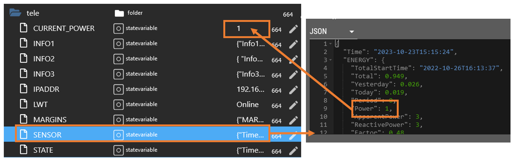
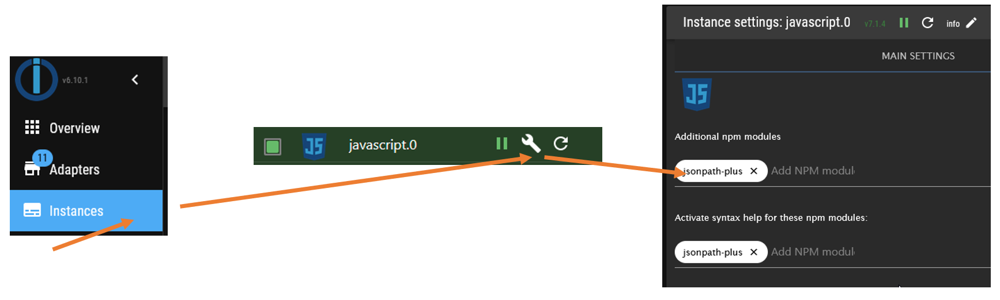

- [JSON State Mapper for ioBroker Javascript Adapter](#json-state-mapper-for-iobroker-javascript-adapter)
  - [Configuration](#configuration)
    - [Mapping Specification](#mapping-specification)
      - [Mapping Item](#mapping-item)
      - [Target Mapping](#target-mapping)
  - [Example](#example)
  - [Usage](#usage)
  - [Requirements](#requirements)
    - [ioBroker Adapter: Javascript](#iobroker-adapter-javascript)
    - [NPM package: JSONPath Plus](#npm-package-jsonpath-plus)
  - [Good Practice](#good-practice)
    - [Use a Test Instance with Debug Log enabled](#use-a-test-instance-with-debug-log-enabled)
    - [Read the Logs watching for Warnings/Errors](#read-the-logs-watching-for-warningserrors)
  - [State of Development](#state-of-development)

# JSON State Mapper for ioBroker Javascript Adapter

JSON State Mapper (JSM) is a helper library for [ioBroker](https://www.iobroker.net/) and specifically for the adapter called [Javascript Script Engine](https://github.com/ioBroker/ioBroker.javascript). It is intended to help automate the extraction of values that are located in JSON documents (let's call the JSON document the value of a source state) and map them to dedicated states (let's call it the values of target states). With the help of this library you don't need to write scripts to do so. Instead you can _configure_ what you wish to do.

For a less abstract explaination let us have a look at an example. Imagine you have a device connected via MQTT that delivers data in form of a JSON document. To be even more specific let's talk about a smart plug running TASMOTA. Then you might end up with a state like `mqtt.0.smarthome.smartplug.tasmota_3E6EDD.tele.SENSOR` where data like this is stored:

```js
{
  "Time": "2023-10-22T13:54:03",
  "ENERGY": {
    "TotalStartTime": "2022-10-26T16:13:37",
    "Total": 0.92,
    "Yesterday": 0.026,
    "Today": 0.015,
    "Period": 0,
    "Power": 1, // <- Object of desire
    "...", "...",
  }
}
```

If you then want to use the value of the `Power` key you need to somehow extract it and ideally have a separate state (like `mqtt.0.smarthome.smartplug.tasmota_3E6EDD.tele.CURRENT_POWER`) where you keep track of the data. Graphically spoken:



Therefore you either need third party tools or you need to use the javascript adapter and produce code or blockly scripts. With the help of this library you can instead configure the mapping. Once configured it can be applied to every new device that produces the same kind of JSON documents. See [configuration](#configuration) for more details and have a look at the [state of development](#state-of-development) to see what this library already is and what it is not (but maybe will become if needed).

## Configuration

JSM reads configurations from all states that are a child of `0_userdata.0.JsonStateMapper` (e. g. `0_userdata.0.JsonStateMapper.TasmotaPowerMeter`). The value of such a state should be a JSON document following this specification:

### Mapping Specification

|              |        |                                                                                                                                                |
| ------------ | ------ | ---------------------------------------------------------------------------------------------------------------------------------------------- |
| filterType   | enum   | Mechanism to identify source nodes where JSON docs are stored that we want to process. Currently only 'Function' based filtering is supported. |
| groupFilter  | string | Text to apply to find source nodes. How this text is used depends on the filterType.                                                           |
| mappingItems | array  | List of [mapping items](#mapping)                                                                                                              |

#### Mapping Item

|                 |        |                                                                                              |
| --------------- | ------ | -------------------------------------------------------------------------------------------- |
| sourceStateName | string | Name of the state that holds the JSON document for which the targetMappings will be applied. |
| targetMappings  | array  | List of [target mapping items](#target-mapping)                                              |

#### Target Mapping

|                   |                   |                                                                                                                                                                                                            |
| ----------------- | ----------------- | ---------------------------------------------------------------------------------------------------------------------------------------------------------------------------------------------------------- |
| targetStateName   | string            | The state to which the data identified via JSON path will written to.                                                                                                                                      |
| jsonPathVal       | string            | A JSON path pointing to a JSON value that will be written to the target state. value.                                                                                                                      |
| jsonPathTimestamp | string (optional) | A JSON path pointing to a JSON value in form of a parsable timestamp that will be used as the target state timestamp. Without explicitely setting this value it will be set by ioBroker and will be "now". |

## Example

Here is a complete example beginning with the objects/configurations given and a description of what the library will do with the help of the configuration.

**Example of an ioBroker object:**


**Example of a mapping configuration:**

```js
// content of an example state `0_userdata.0.JsonStateMapper.TasmotaPowerMeter`
{
  "groupFilter": "power_meter.tasmota_power_meter", // Name of the function because filterType is function
  "filterType": "Function",
  "mappingItems": [
    {
      "sourceStateName": "INFO2",
      "targetMappings": [
        {
          "targetStateName": "IPADDR",
          "jsonPathVal": "$.Info2.IPAddress"
        }
      ]
    },
    {
      "sourceStateName": "SENSOR",
      "targetMappings": [
        {
          "targetStateName": "CURRENT_POWER",
          "jsonPathVal": "$.ENERGY.Power",
          "jsonPathTimestamp": "$.Time"
        }
      ]
    }
  ]
}
```

**Example payload of SENSOR**

```js
{
  "Time": "2023-10-22T13:54:03",
  "ENERGY": {
    "TotalStartTime": "2022-10-26T16:13:37",
    "Total": 0.92,
    "Yesterday": 0.026,
    "Today": 0.015,
    "Period": 0,
    "Power": 1, // <- Object of desire
    "...", "...",
  }
}
```

**Example payload of INFO2**

```js
{
  "Info2": {
    "WebServerMode": "Admin",
    "Hostname": "tasmota-3E6EDD-3805",
    "IPAddress": "192.168.2.244"
  }
}
```

This library will identify all states that are associated with the function `tasmota_power_meter`. From these filtered states it will subscribe to changes only of those states that have the same name like the source states listed in the mapping items (`INFO2` and `SENSOR`). Then each time on of those source states changes the resulting JSON documents (see examples above) will be parsed with the help of the JSON pathes. For `SENSOR` the value of `POWER` (-> 1) will be read as well as the timestamp from `Time` (-> 2023-10-22T13:54:03). The read value and timestamp are then written to `CURRENT_POWER`. From `INFO2` the IP will be read and written to `IPADDR`.

## Usage

Copy the source of [JsonStateMapper.ts](./src/JsonStateMapper.ts) into a seperate TypeScript and let it run.

You need to rerun it every time you change the configuration to take effect.

## Requirements

In order to make use of this library you need to meet this requirements:

### ioBroker Adapter: Javascript

This library is dedicated to users of the ioBroker [Javascript Script Engine](https://github.com/ioBroker/ioBroker.javascript). So you need to install it from the available adapters in ioBroker ;)

### NPM package: JSONPath Plus

This library uses [JSONPath Plus](https://github.com/JSONPath-Plus/JSONPath) for JSON path exression evaluation. Therefore you need to add it as a seperate module to the Javascript Script Engine adapter. Therefore

- open the `Instances` menu
- click on the jaw spanner for the javascript.x instance
- create an entry `jsonpath-plus`
- save and close



## Good Practice

### Use a Test Instance with Debug Log enabled

It is a good idea to have two seperate instances of javascript installed. A test instance and a production one. On the one hand you can test code on the test instance and you can be sure to not ruin anything related to the production instance as soon as the test instance fails somehow (exceptions, reloads, ...). On the other hand you can increase the logging verbosity to see what is going on in the test instance without polluting the production logs. So my recommendation is:

- javascript.x - prod environment - log level: info
- javascript.y - test environment - log level: debug


### Read the Logs watching for Warnings/Errors

If something does not work as expected, have a look at the logs. There you can filter by 'Source' (javascript.x) and 'Message' (JSM) to extract only the relevant logs for this library:


## State of Development

This library actually is the result of my personal attempt to understand better the way that ioBroker works and it is built to solve a actual problem I came across that I found no suitable solution for. So at the point being it is kind of opinionated (~> It does the things in a way that I think is a good and scalable approach - but without a guaranty that this proofs to be true :)) and solves only the core issue I had without and is not yet a fully fledged solution for end to end automation of mapping. In other words: It has a minimalistic feature set right now. But as the time passed along I thought it might be something someone else also finds useful so I decided to publish it and see if anybody is interested and maybe there will be further improvements if needed.

Implemented:

- Stability
- Subcsribe to changes of source states
- Function based filtering of source states that should be processed

Not implemented:

- Graphical UI for configuration tasks (not feasable with this approach, would require a shift to adapter development)
- Selector based filtering of source states that should be processed
- Scheduled reading of source states and updating the target states
- Automatic creation of target State if it does not exist
